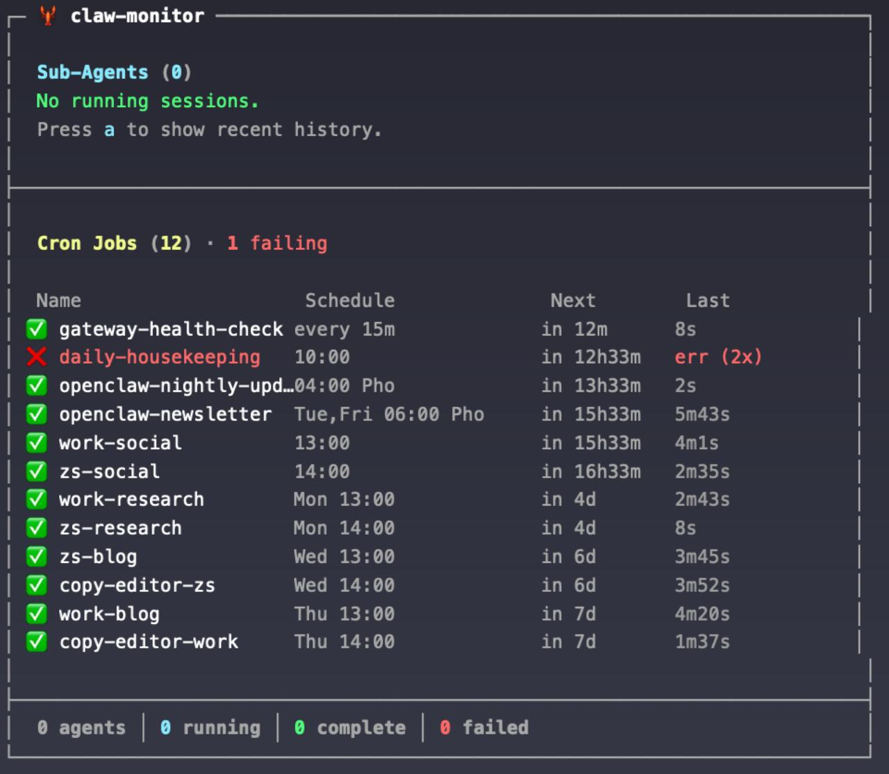

# 🦞 claw-monitor

A terminal UI for monitoring [OpenClaw](https://github.com/openclaw/openclaw) agents, cron jobs, and system resources in real-time.


## Features

### Sub-Agent Monitoring
- **Live session tracking** — Watch sub-agents work in real-time with status updates
- **Session labels** — Shows spawn labels for easy identification
- **Tool activity** — Displays the current tool being executed and total tool calls
- **Elapsed time** — Track how long each session has been running
- **Toggle modes** — Switch between "running only" and "all recent" views (`a` key)

### Coding Agent Detection
- **Process monitoring** — Detects running Claude Code, GitHub Copilot CLI, and Codex processes
- **Attach commands** — Jump into any coding agent's interactive tmux session
- **PID and runtime** — See process IDs and cumulative CPU time

### Cron Job Dashboard
- **All jobs at a glance** — Lists every cron job with name, schedule, next run, and last duration
- **Human-readable schedules** — Translates cron expressions to readable format (`Mon 13:00`, `every 15m`, `Tue,Fri 06:00`)
- **Relative next-run times** — Shows when each job fires next (`in 8m`, `in 4d`)
- **Error tracking** — Highlights failing jobs with consecutive error counts
- **Running indicator** — Shows which jobs are actively executing
- **Sorted by next run** — Soonest jobs appear first

### System Resource Gauges
- **CPU usage** — Bar chart with percentage and core count
- **Memory usage** — Bar chart with used/total GB
- **Disk usage** — Bar chart with used/total GB
- **Color-coded** — Green (healthy), yellow (70-90%), red (>90%)




## Install

```bash
git clone https://github.com/DanWahlin/claw-monitor.git
cd claw-monitor
npm install
npm run build
```

## Usage

```bash
./bin/claw-monitor.js
```

Or add to your PATH for global access:

```bash
npm link
claw-monitor
```

### Controls

| Key | Action |
|-----|--------|
| `q` | Quit |
| `a` | Toggle between running-only and all sessions |
| `Ctrl+C` | Quit |

## Coding Agent Attach Commands

claw-monitor detects running coding agents (Claude Code, GitHub Copilot CLI, Codex) via process monitoring. To jump into an agent's interactive terminal session, use the attach commands included in `bin/`:

### Setup

```bash
# Symlink to PATH (one-time)
sudo ln -sf "$(pwd)/bin/cc-attach" /usr/local/bin/cc-attach
sudo ln -sf "$(pwd)/bin/copilot-attach" /usr/local/bin/copilot-attach
sudo ln -sf "$(pwd)/bin/codex-attach" /usr/local/bin/codex-attach
```

### Commands

| Command | Attaches to | Model |
|---------|------------|-------|
| `cc-attach` | Claude Code | Opus 4.6 |
| `copilot-attach` | GitHub Copilot CLI | GPT-5 / Sonnet / Gemini |
| `codex-attach` | Codex | GPT-5.2 |

Detach from any session with `Ctrl+B` then `D` — the agent keeps running in the background.

> **Note:** These commands attach to tmux sessions named `cc`, `ghcp`, and `codex`. The sessions are created by your OpenClaw agent when it launches coding tasks. If no session is running, you'll see a message telling you to start one.

## Requirements

- Node.js 18+
- OpenClaw installed and running
- tmux (for coding agent attach/detach)

## How It Works

### Sub-Agents
Watches OpenClaw's session directory (`~/.openclaw/agents/main/sessions/`) and `sessions.json` metadata to identify sub-agent sessions, parse JSONL logs for tool usage, and track activity via `updatedAt` timestamps. Polls every 500ms.

### Coding Agents
Polls `ps aux` every 5 seconds to detect running coding agent processes:

| Agent | Process pattern | Icon |
|-------|----------------|------|
| Claude Code | `claude --dangerously` | 🤖 |
| GitHub Copilot CLI | `gh copilot` | 🐙 |
| Codex | `codex` | 📦 |

Filters out wrapper processes (sudo, bash, node shims) and deduplicates to one entry per agent type.

### Cron Jobs
Runs `openclaw cron list --json` every 15 seconds. Parses schedules into human-readable format, calculates relative next-run times, and tracks consecutive errors.

### System Stats
Uses `os.totalmem()`/`os.freemem()` for memory, `top` for CPU, and `df` for disk. Updates every 10 seconds.

## Built With

- [ink](https://github.com/vadimdemedes/ink) — React for CLI apps
- [chokidar](https://github.com/paulmillr/chokidar) — File watching
- [tmux](https://github.com/tmux/tmux) — Terminal multiplexing for coding agent sessions

## License

MIT © Dan Wahlin
